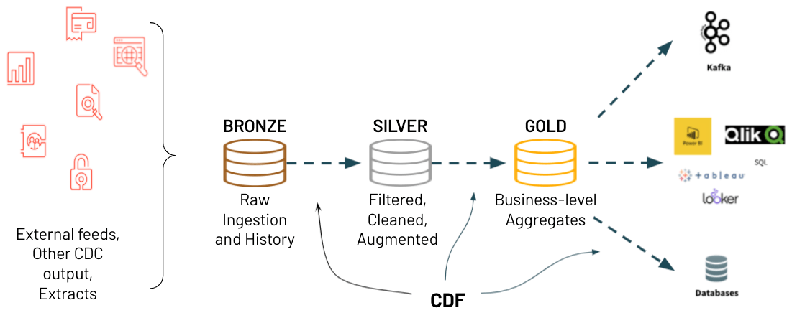

# Minimum Jazz

Minimum Jazz is a sample Apache Spark data engineering pipeline project.  There are two use cases demonstrated in this project.  The first one is to show best practices processing XML data using Apache Spark.  The second aim is apply a named entity recognizer (NER) as part of that data processing pipeline.  

## Prerequisites

Please read the [contributing guide](CONTRIBUTING.md) on how to set up your environment. 

## Data Generation Module

The XML data generation module uses the faker library and xml.etree Python library

```python
from jazz.data import generate

raw_path = "/dbfs/home/username/minimum_jazz/raw"
generate(raw_path, 10)
```
## Pipeline Module

The pipeline module facilitates processing the XML data according to the Medallion Architecture.  The medallion architecture takes raw data landed from source systems and refines the data through bronze, silver and gold tables. A table is a representation of data in a row/column format.  Developers can then use the various Spark API's to interact with the data. 



The optimal way of implementing the bronze, silver, and gold tables in the medallion architecture is to use Delta Lake.  Delta Lake is an open-source project that enables building a Lakehouse Architecture on top of existing storage systems.  
### to_bronze()

The to_bronze() method is responsible for reading data from an upstream data source and staging it in a RAW table. The data in the bronze table should be as close to raw as possible. Advise to keep the original column names and table names the same. This makes it easier to trace back when investigating or reporting issues in the source.

In the following example to_bronze() returns a Spark DataFrame.

```python
from jazz.pipeline import to_bronze

bronze_df = to_bronze(spark, "dbfs:/home/scott.stafford@databricks.com/minimum_jazz/raw")
bronze_df.show()
```

### to_silver()

Once you have a bronze table, the next step is to begin shaping the raw data into a more usable shape.  The master schema should contain correctly modelled tables, that are appropriately named. Column names should also be corrected along with their data types.  Below are examples of additional operations that may be conducted in a to_silver() method.  

 - Standardising all date formats and time zones to be the same (where appropriate)
 - Rounding numbers where appropriate to fewer decimal places
 - Cleaning strings to maybe fix capitalisation or remove start and end white spaces
 - Standardising addresses to be of the same format
 - Splitting data out into multiple columns or extracting it from JSON

In the following example to_silver() returns a Spark DataFrame

```python
from jazz.pipeline import to_silver

silver_df = to_silver(bronze_df)
silver_df.show()
```

### to_gold()

## Training Linear Model

### Starting mlflow locally

```
mlflow server --backend-store-uri sqlite:///mlflow.db --default-artifact-root ./mlruns 
```

### Creating model

```
python jazz/train.py --mlflow_tracking_uri=http://127.0.0.1:5000 --experiment=happiness_experiment
```

### Serving model

#### From Python

```
python jazz/apply_model.py --mlflow_tracking_uri=http://127.0.0.1:5000 --model_name=happiness_prophet
```

#### From REST API point

Deploy model locally as local REST API endpoints

```
MLFLOW_TRACKING_URI=http://127.0.0.1:5000
mlflow models serve -m runs:/<run_id>/model --no-conda --port 5001
```

Execute endpoint

```
curl http://127.0.0.1:5001/invocations -H 'Content-Type: application/json' -d '{ "data": [[-10], [-9]] }'
```

